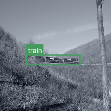
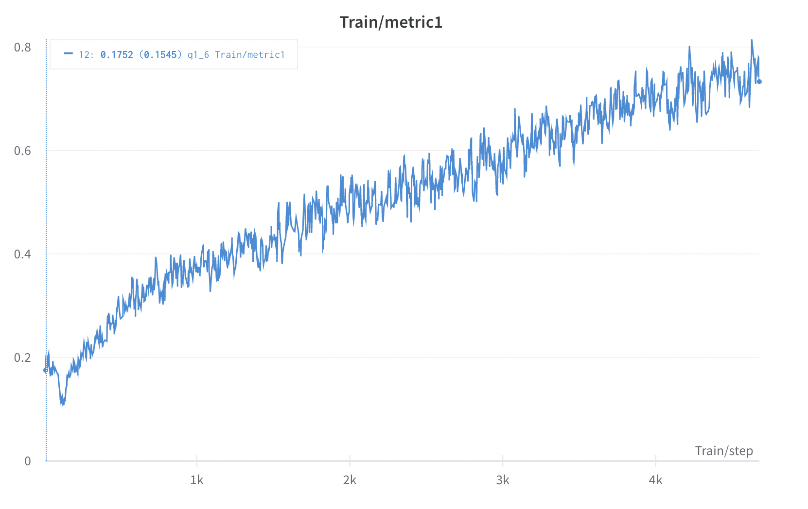
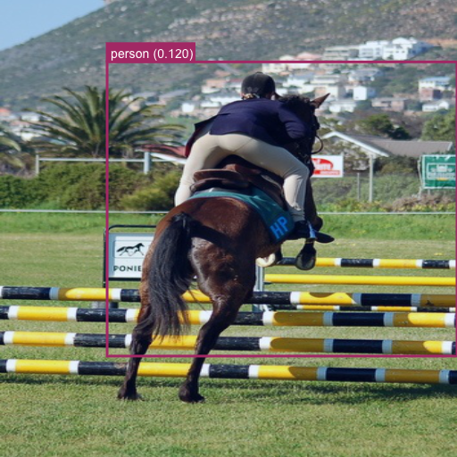

# Weakly Supervised Object Localization

#### Q 0.1: What classes does the image at index 2020 contain (index 2020 is the 2021-th image due to 0-based numbering)?

Image at index 2020 has the following classes: "Train"

#### Q 0.2: You might have noticed that each image has a certain number of proposals from selective search. Often, this number is a lot more than we require. What is the easiest way to select the most informative regions? (Hint: look at the scores corresponding to each proposal in `voc_2007_trainval.mat`).

The easiest way to select the most informative boxes can be to selected the ones with the highest confidence scores. Since the confidence score is
an indicator of the likelihood of the present on an object, it is intuitive to filter boxes based on it.

#### Q 0.3 Use Wandb to visualize the ground-truth bounding box and the class for the image at index 2020.

#### Q 0.4 Use Wandb to visualize the top ten bounding box proposals for the image at index 2020.

#### Q 1.1 Fill in each of the TODO parts except for the functions ``metric1``, ``metric2`` and ``LocalizerAlexNetRobust``. In the report, for each of the TODO, describe the functionality of that part. The output of the above model has some spatial resolution. Make sure you read paper [1] and understand how to go from the output to an image level prediction (max-pool). (Hint: This part will be implemented in ``train()`` and ``validate()``.
1. Loss function (BCE Loss), Optimizer (SGD) and LR scheduler(decayed by 0.1 every 30 steps) are defined.
2. Training and validation datasets are defined. Input image size is 512 x 512. The dataset contains the image, roi, and annotation information
3. wandb project is initialized using wandb.init()
4. Images and labels are loaded from the dataloader
5. model out is obtained with a forward pass through the model
6. Max pooling (in case of AlexNet localizer) or Average Pooling (in case of Alexnet robust) is applied to go to a 1x1 prediction
7. Loss is computed w.r.t. target label using BCELoss()
8. Backpropagation and weight updates are done using loss.backward() and optimizer.step()
9. Loss, metrics and heatmaps are logged in wandb (heatmaps are resized to 512 x 512 to match input image size)
10. Model prediction, loss, metric computation and logging are done for the validation dataset. Heatmaps are also logged.

#### Q 1.2 What is the output resolution of the model?
(29 x 29)

#### Q 1.3 Initialize the model from ImageNet (till the conv5 layer). Initialize the rest of layers with Xavier initialization and train the model using batchsize=32, learning rate=0.01, epochs=2 (Yes, only 2 epochs for now).(Hint: also try lr=0.1 - best value varies with implementation of loss)

| | ||
|:---:|:---:|:---:|
| *original* | *epoch 0* | *epoch 1* |

| |||
|:---:|:---:|:---:|
| *original* | *epoch 0* | *epoch 1* |
#### Q 1.4 In the first few iterations, you should observe a steep drop in the loss value. Why does this happen? (Hint: Think about the labels associated with each image).
This is because each image has very few classes present (mostly one or two). So it is mostly a sparse one-hot encoding of labels. 
Consequently, initially, the path of least resistance for the network is to simply predict zeros and that allows a sharp drop in the loss. 
As training progresses, the network must eventually learn to make correct predictions for the classes present to decrease the loss hence the loss falls off slowly later on. 

#### Q 1.5 We will log two metrics during training to see if our model is improving progressively with iterations. The first metric is a standard metric for multi-label classification. Do you remember what this is? Write the code for this metric in the TODO block for ``metric1`` (make sure you handle all the boundary cases). However, ``metric1`` is to some extent not robust to the issue we identified in Q1.4. The second metric, Recall, is more tuned to this dataset. Even though there is a steep drop in loss in the first few iterations ``metric2`` should remain almost constant. Implement it in the TODO block for ``metric2``. (Make any assumptions needed - like thresholds).

Metric1 is mAP and Metric2 is recall(threshold = 0.5)

#### Q 1.6 Initialize the model from ImageNet (till the conv5 layer), initialize the rest of layers with Xavier initialization and train the model using batchsize=32, learning rate=0.01, epochs=30. Evaluate every 2 epochs. (Hint: also try lr=0.1 - best value varies with implementation of loss) \[Expected training time: 45mins-75mins].

|||
|:---:|:---:|

|||
|:---:|:---:|

|||||
|:---:|:---:|:-----------------------------------------------------:|:---:|
| *original* | *epoch 0* |                      *epoch 15*                       | *epoch 30* |

|||||
|:---:|:---:|:-----------------------------------------------------:|:---:|
| *original* | *epoch 0* |                      *epoch 15*                       | *epoch 30* |

||  |
|:---:|:---:|
| *original* |                        *Val heatmap*                         |  
||  |
| *original* |                        *Val heatmap*                         |  
||  |
| *original* |                        *Val heatmap*                         |  

Train: 

    Metric 1: 0.704 

    Metric 2: 0.599 

    Loss: 0.0948 

Val: 

    Metric1: 0.4978 

    Metric2: 0.4349 

#### Q 1.7 In the heatmap visualizations you observe that there are usually peaks on salient features of the objects but not on the entire objects. How can you fix this in the architecture of the model? (Hint: during training the max-pool operation picks the most salient location). Implement this new model in ``LocalizerAlexNetRobust`` and also implement the corresponding ``localizer_alexnet_robust()``. Train the model using batchsize=32, learning rate=0.01, epochs=45. Evaluate every 2 epochs.(Hint: also try lr=0.1 - best value varies with implementation of loss)

With Alexnet_localizer I used global max pooling to get the 1x1 predicted output.
With Alexnet_robust I used global average pooling to get the 1x1 predicted output.

||  |
|:---:|:--------------------------:|

|  ||
|:--------------------------:|:------------------------:|

Train:

||           |  |  |
|:---:|:---------:|:-------------------------------------------------------:|:-----------------------------------------------------------:|
| *original* | *epoch 0* |                        *epoch 22*                        |                         *epoch 45*                          |

||| |  |
|:---:|:---:|:--------------------------------------------------------:|:-----------------------------------------------------------:|
| *original* | *epoch 0* |                        *epoch 22*                         |                         *epoch 45*                          |

Val:

||  |
|:---:|:------------------------------------------------------------:|
||  |
|:---:|                            :---:                             |
|| |
| *original* |                           *Val heatmap*                            |  

Train: 

    Metric 1: 0.9461 

    Metric 2: 0.9271 

    Loss: 0.03323 

Val: 

    Metric1: 0.8589

    Metric2: 0.7969

## Task 2: Weakly Supervised Deep Detection Networks

||||
|:---:|:---:|:---:|

#### Class-wise AP

||||
|:---:|:---:|:---:|
||||

Class-wise AP: (Please ignore the middle column, AP are on the left, class on the right)

##### **mAP: 0.13**

#### First Epoch:

||||
|:---:|:---:|:---:|
||||
||||

#### Last Epoch:

||||
|:---:|:---:|:---:|
||||
||||

